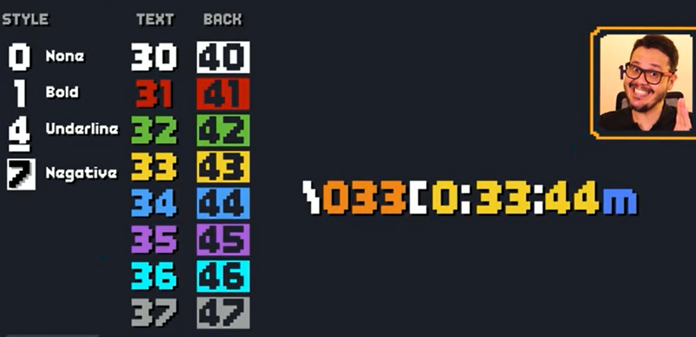
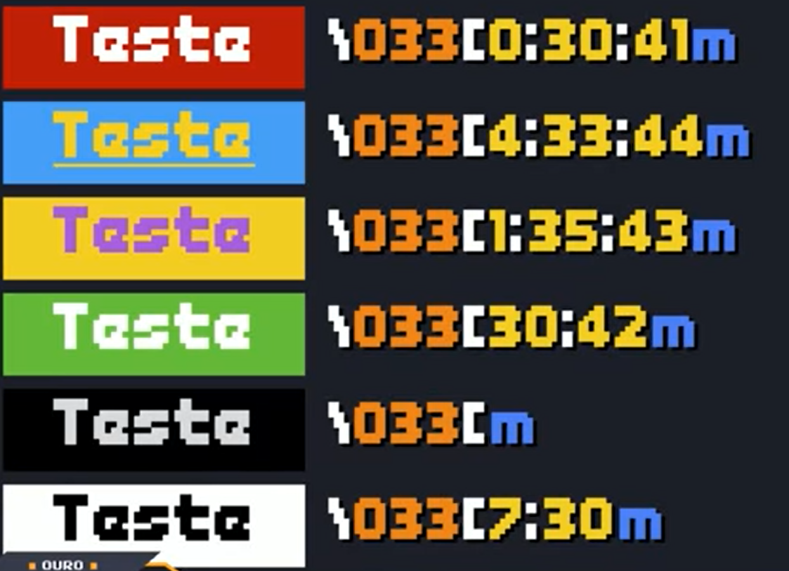
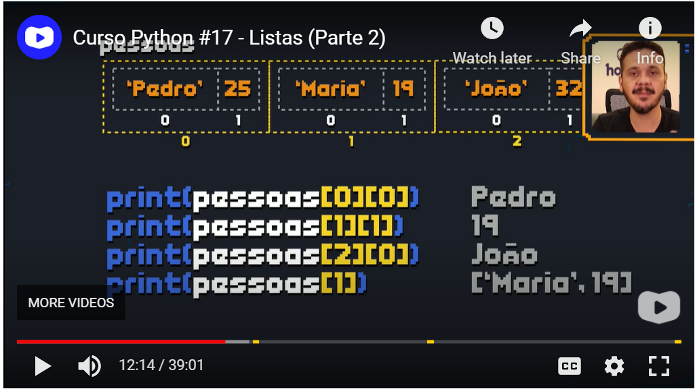

# curso-em-video-python
https://www.cursoemvideo.com/cursos/  

# Site oficial do python  
https://www.python.org/ 

# Ordem de precedencia - Operadores artimeticos
1  () tudo o que estiver dentro dos parênteses  
2  ** Potência  
3  * / //(Divisao inteira)  % - O que aparecer primeiro caso estejam em uma mesma operação  
4  + -  

# Imports
Para importar uma lib completa usar  
import nomelib  
para importar apenas um elemento da lib usar  
from nomelib import nomeelemento  
Para importar dois ou mais elementos da lib usar  
from nomelib import nomeelemento1, nomeelemento2, ...

[Documentação Python de libs](https://docs.python.org/3/library/index.html)  

[Instalar o pygame](https://www.pygame.org/wiki/GettingStarted) 
~~~python
py -m pip install -U pygame --user
~~~  

Padrão ANSI  
Padrão de normalização internacional que funciona em vários ambientes, tudo em ANSI começa com \codigo  
ex de ANSI para cores:  
\033[style;text-color;backgoundm  
\033[0;33;44m  
  

Exemplos:  
]  

Para não pular linha no print, colocar , end='' no final  
~~~python
print('{}'.format(contador), end='')
~~~

Mundo 03 - Tuplas
As tuplas são imutáveis, funcionam semelhantes as listas, como no exemplo da aula 16 do mundo 03  

Listas são mutáveis e são usadas com colchetes []  

Listas compostas - Listas dentro de listas  
  

[:] significa cópia da lista, se eu fizer apenas o append, uma lista vai estar relacionada a outra  

Interactive Help  
É o manual completo das funcionlidades pytbon, basta ir em Python Console no Pycharm e digitar help()  
Vai ser aberto o console com >? que é o console do interactive help, após isso basta digitar o nome da  
função que você precisa ver os detalhes, como por exemplo o print, para sair digitar quit  
ou então no pycharm mesmo digitar help(print), também vai ser mostrado o manual do print  

